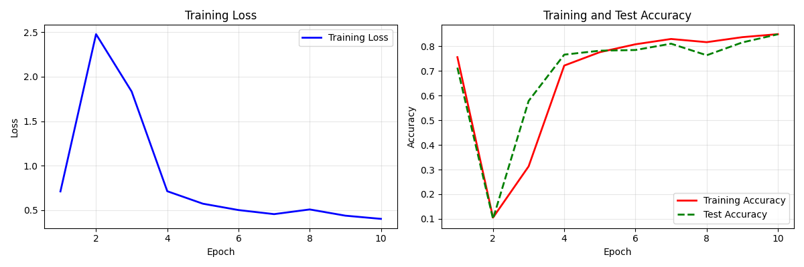

# Modern-Convolutional-Neural-Network
Python | Deep Learning | Chapter 07 Modern Convolutional Neural Network (Modern CNN)
# 现代卷积神经网络

- 本章将介绍现代的卷积神经网络架构，许多现代卷积神经网
络的研究都是建立在这一章的基础上的。
- 《动手学深度学习》这本书的 第7章 “现代卷积神经网络” 实现以及代码解析。

## 简介
这些模型包括：
- AlexNet。它是第一个在大规模视觉竞赛中击败传统计算机视觉模型的大型神经网络；
- 使用重复块的网络（VGG）。它利用许多重复的神经网络块； 
-网络中的网络（NiN）。它重复使用由卷积层和1 × 1卷积层（用来代替全连接层）来构建深层网络;
- 含并行连结的网络（GoogLeNet）。它使用并行连结的网络，通过不同窗口大小的卷积层和最大汇聚层
来并行抽取信息；
- 残差网络（ResNet）。它通过残差块构建跨层的数据通道，是计算机视觉中最流行的体系架构；
- 稠密连接网络（DenseNet）。它的计算成本很高，但给我们带来了更好的效果。
- 仅限于以后方便查看和学习。

### 核心技术
- **深度学习**: PyTorch
- **数据处理**: Pandas, NumPy
- **可视化**: Matplotlib

## 🛠 环境配置

### 系统要求
- **操作系统**: Windows 10/11
- **内存**: 最低8GB，推荐16GB
- **存储**: 至少2GB可用空间

### Python环境
- **Python完整版本**: 3.9.23

### 深度学习框架
- **PyTorch**: 1.11.0+cu113
- **Torchvision**: 0.12.0+cu113
- **CUDA**: 11.3
- **当前GPU**: NVIDIA GeForce RTX 2060 with Max-Q Design

### 数据科学库
- **Pandas**: 2.0.3
- **NumPy**: 2.0.3
- **Scikit-learn**: 1.6.1
- **Matplotlib**: 3.7.2

### 7.5 批量规范化层 结果图

